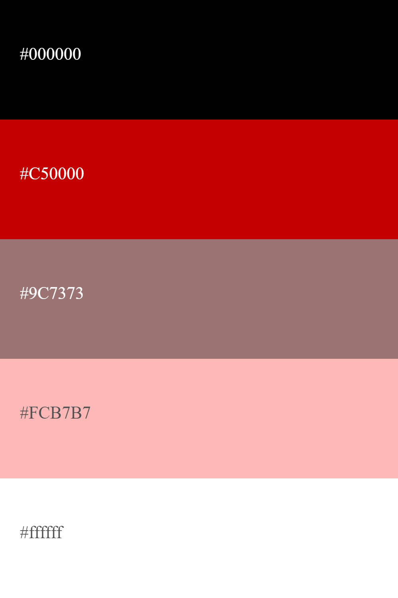
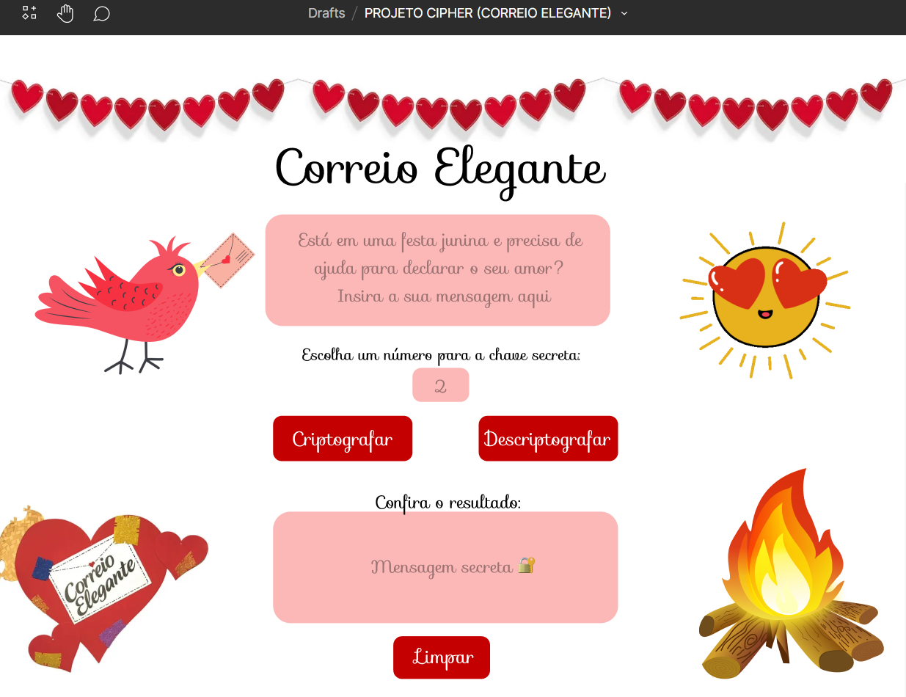

# 
 💌 CORREIO ELEGANTE CIFRADO 💌

### Acesse o projeto completo [CLICANDO AQUI](https://vanessanmenezes.github.io/Cipher/)

***

## Resumo do projeto

Neste projeto, foi criado um aplicativo da Web que permita ao usuário cifrar mensagens. Nela, o usuário pode cifrar e decifrar um texto no navegador indicando um deslocamento
específico de caracteres. Fui desafiada a criar uma interface que deve permitir ao usuário: 

* **Criptografar uma mensagem**
  - Inserir a mensagem (texto) que deseja criptografar. A mensagem usa um
    alfabeto simplificado.
  - Escolher um número de deslocamento indicando quantas posições
    você deseja que a cifra desloque cada caractere do alfabeto.
  - Veja o resultado da mensagem criptografada.

* **Descriptografar uma mensagem**
  - Inserir a mensagem (texto) que deseja descriptografar. A mensagem usa um
    alfabeto simplificado.
  - Escolher um número de deslocamento indicando quantas posições você deseja que a cifra
    desloque cada caractere do alfabeto.
  - Veja o resultado da mensagem descriptografada.

## E como esse mensagem é criptografada e descriptografada?

Atráves da cifra de César. Cifrar significa codificar. A cifra de César é um dos primeiros tipos de criptografias conhecidas na história. O imperador romano Júlio César utilizava essa cifra para enviar ordens secretas aos seus generais no campo de batalha. A cifra de César é uma das técnicas mais simples de cifrar uma mensagem. É um tipo de cifra por substituição, em que cada letra do texto original é substituida por outra que se encontra há um número fixo de posições (deslocamento) mais a frente do mesmo alfabeto.

***

## DEFINIÇÃO DO PRODUTO

O aplicativo web de Cifra **CORREIO ELEGANTE CIFRADO**, foi planejada com o intuito de fornecer uma página simples e intuitiva direcionada ao público que frequenta festas juninas. Correio Elegante é uma brincadeira típica de festas juninas em que uma pessoa envia um bilhetinho para ser entregue a uma outra pessoa. Pois bem, o bom e velho correio elegante, o bisavô dos torpedos, ainda que meio sem função hoje em dia, é sempre resgatado durante as festas juninas com suas quermesses e brincadeiras. Afinal, não dá para negar que é uma forma criativa de se declarar a alguém. Nesta interface, há uma contribuição para que as pessoas possam criar mensagens secretas para manisfestar seu amor atráves do correio elegante, tornando a festa junina ainda mais divertida! 

## Nível de EXPERIÊNCIA e INTERFACE

A interface do usuário (UI), ou seja, a parte visual desse projeto, foi pensada com base nas cores típicas de elemetos juninos e que estão ligadas à mensagens românticas. Atráves da psicologia das cores, foi escolhida a cor vermelha, que representa amor, paixão e aventura, e rosa, que representa romantismo, ternura e felicidade. Como estamos falando de uma página direcionada para declarações, estas cores foram definidas. Sendo assim, a paleta abaixo foi selecionada para estabelecer a comunicação visual entre usuário e marca (CORREIO ELEGANTE CIFRADO), fortalecendo a identidade visual dessa plataforma e tornando-a reconhecível.

  

Tanto a interface, quanto a experiência do usuário, foram pensadas e baseadas atráves de um protótipo construído no figma (imagem abaixo). A experiência do usuário (UX), foi de forma geral estabelecida de maneira fácil, compreensível, simples, intuitiva e até mesmo interessante de ser utilizada pelo público-alvo.

  

***

## ESTE PROJETO FOI CRIADO E DESENVOLVIDO POR: [VANESSA MENEZES](https://github.com/VanessaNMenezes) ❤️

***